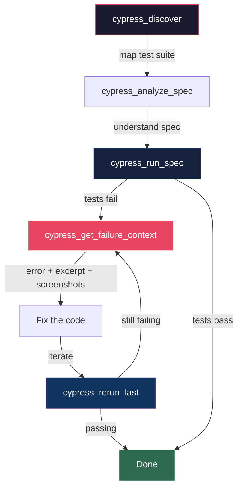

# cypress-mcp

[](https://www.npmjs.com/package/cypress-mcp)
[](LICENSE)
[](https://github.com/jams4code/cypress-mcp/actions/workflows/ci.yml)
[](https://nodejs.org)

MCP server that gives AI coding agents full control over Cypress test execution.

Run, debug, and iterate on E2E tests directly from Claude Code, Cursor, Windsurf, or any MCP-compatible agent — without switching to a terminal.

## Install

| Package Manager | Command |
|----------------|---------|
| **npx** (no install) | `npx cypress-mcp --cwd /path/to/project` |
| **npm** | `npm install -g cypress-mcp` |
| **pnpm** | `pnpm add -g cypress-mcp` |
| **yarn** | `yarn global add cypress-mcp` |
| **bun** | `bun add -g cypress-mcp` |
| **From GitHub** | `npx github:jams4code/cypress-mcp` |

## Quick Start

Register with your MCP client:

**Claude Code:**
```bash
claude mcp add cypress-mcp -- npx cypress-mcp --cwd /path/to/project
```

**Cursor / VS Code:**
```json
{
  "mcpServers": {
    "cypress": {
      "command": "npx",
      "args": ["cypress-mcp", "--cwd", "/path/to/your/project"]
    }
  }
}
```

**Windsurf:**
```json
{
  "mcpServers": {
    "cypress": {
      "command": "npx",
      "args": ["cypress-mcp", "--cwd", "/path/to/your/project"]
    }
  }
}
```

## Why

AI agents can write Cypress tests but can't run them. Every change requires you to switch to terminal, run `npx cypress run`, wait, copy the output back. This kills iteration speed.

**cypress-mcp** closes the loop. The agent runs specs, reads failures, views screenshots, inspects crash context, reruns the last command, and discovers the test suite — all within the conversation.

## Tools (11)

### Core Loop

| Tool | What it does |
|------|-------------|
| `cypress_run_spec` | Run a spec file headless, get structured JSON results |
| `cypress_run_test` | Run a single test by name (grep filter) |
| `cypress_rerun_last` | Replay the exact last run without rebuilding arguments |
| `cypress_list_specs` | List all spec files with test counts |

### Debug

| Tool | What it does |
|------|-------------|
| `cypress_get_failure_context` | Compact debugging bundle: error, stack, spec excerpt, screenshots, next actions |
| `cypress_get_screenshot` | Find failure screenshots by spec or test name |
| `cypress_get_last_run` | Full results of the most recent run |

### Discovery

| Tool | What it does |
|------|-------------|
| `cypress_discover` | Map the entire test suite: specs, test names, counts |
| `cypress_analyze_spec` | Deep-parse a spec: describe blocks, visits, intercepts, fixtures |

### Setup

| Tool | What it does |
|------|-------------|
| `cypress_get_env` | Show cypress.env.json (secrets masked) |
| `cypress_doctor` | Health check: config, binary, specs, support file, directories |

## How It Works


- **stdio transport** — the agent spawns the server as a child process
- **Serial execution** — one Cypress run at a time, no concurrency
- **Structured output** — JSON results with failure details, diffs, screenshot paths
- **Config-aware** — auto-detects `cypress.config.*`, follows relative imports, respects custom paths
- **Cross-platform** — Windows, macOS, Linux

## Agent Workflow



## Configuration

Works out of the box for standard Cypress projects. For custom setups, create `cypress-mcp.config.json`:

```json
{
  "defaultBrowser": "chrome",
  "defaultTimeout": 600000,
  "cypressConfigFile": "config/cypress.config.ts",
  "specPattern": ["e2e/**/*.cy.ts"],
  "supportFile": "support/e2e.ts",
  "titleFilterSupport": true,
  "screenshotsDir": "cypress/screenshots"
}
```

## Supported Versions

- Cypress 12.x — 15.x
- Node.js 18+
- Windows, macOS, Linux

## Registry Status

| Registry | Package | Status |
|----------|---------|--------|
| **npm** | [`cypress-mcp`](https://www.npmjs.com/package/cypress-mcp) | Published |
| **GitHub** | [`jams4code/cypress-mcp`](https://github.com/jams4code/cypress-mcp) | Source |

## Development

```bash
git clone https://github.com/jams4code/cypress-mcp.git
cd cypress-mcp
npm install
npm run build
npm test
```

## License

[Business Source License 1.1](LICENSE) — free for individuals, education, and open source. Commercial production use requires a license. See [LICENSING.md](LICENSING.md) for details.

Converts to Apache 2.0 on March 25, 2029.

Licensed by [JADEV GROUP SARL](https://jadev-group.com) (BE1027.114.687), Brussels, Belgium.
